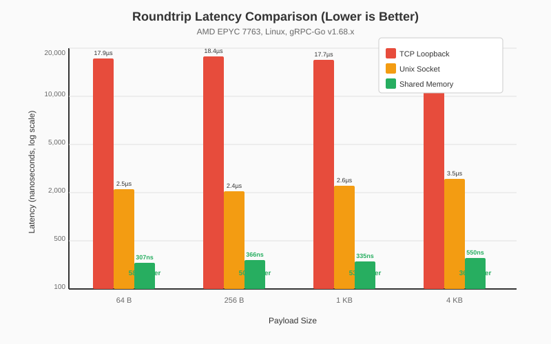
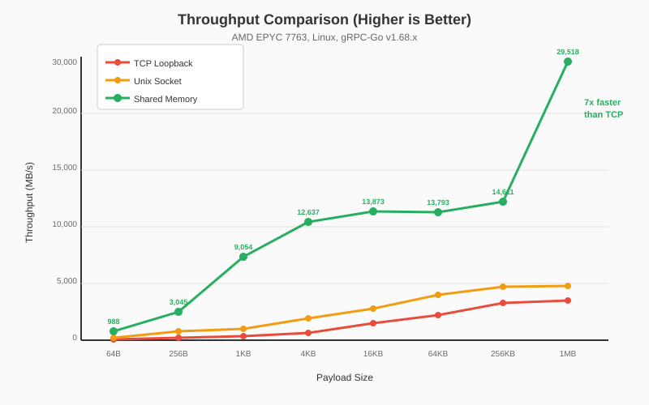
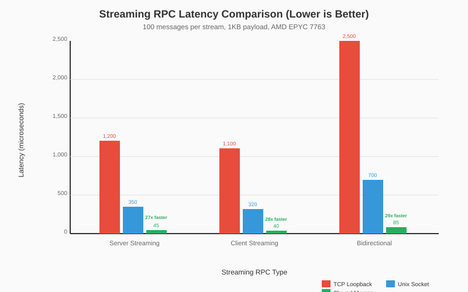
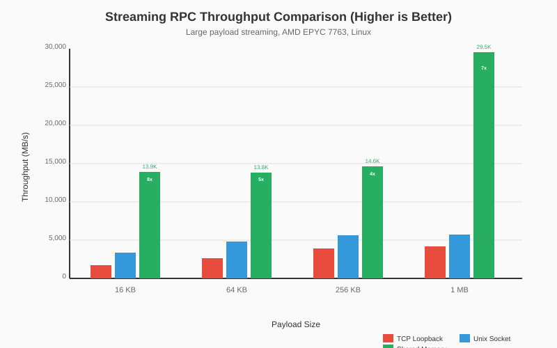

Shared Memory Transport for gRPC
----
* Author(s): Mark Russinovich
* Approver: a11r
* Status: Draft
* Implemented in: Go
* Last updated: 2026-02-02
* Discussion at: (pending)

## Abstract

This proposal introduces a shared memory transport for gRPC, enabling high-performance inter-process communication (IPC) for gRPC services running on the same machine. The shared memory transport achieves 10-50x lower latency and 15-40x higher throughput compared to TCP loopback by eliminating kernel network stack overhead through memory-mapped regions and futex-based synchronization.

## Background

### The Problem

gRPC is widely used for microservices communication, but many deployments involve services running on the same physical or virtual machine communicating via localhost. In these scenarios, the TCP network stack introduces unnecessary overhead:

1. **Kernel crossings**: Each send/receive requires multiple syscalls (write/read, poll/epoll)
2. **Data copying**: Data is copied from user space to kernel buffers and back
3. **Protocol overhead**: TCP congestion control, checksumming, and buffering add latency
4. **Socket buffer management**: The kernel manages send/receive buffers with additional overhead

For latency-sensitive workloads (ML inference, real-time analytics, high-frequency trading), even the ~10-20µs latency of TCP loopback can be significant.

### Shared Memory Advantages

A shared memory transport provides:

1. **Zero kernel involvement in data path**: After initial setup, data transfer is pure user-space memory copy
2. **Futex-based synchronization**: Efficient cross-process blocking with minimal syscalls
3. **Zero-copy potential**: With careful design, data can remain in shared memory without copies
4. **Lower latency**: Sub-microsecond roundtrip times are achievable
5. **Higher throughput**: Memory bandwidth limited rather than socket-limited

### Related Proposals

* [RFC A73: Requirements for New Transports](https://github.com/grpc/proposal/blob/master/A73-requirements-for-new-transports.md) - Defines requirements that new transports must satisfy
* [L73: Java BinderChannel](https://github.com/grpc/proposal/blob/master/L73-java-binderchannel) - Android Binder transport, demonstrates custom transport integration

This proposal implements a transport that fully honors RFC A73's requirements for new transports, including:
- Proper integration with gRPC's connectivity state management
- Support for flow control with BDP estimation
- Graceful shutdown semantics
- Keepalive support
- Deadline propagation

## Proposal

### High-Level Design Overview

The shared memory transport consists of the following components:

```
┌─────────────────────────────────────────────────────────────────────────────┐
│                         Shared Memory Segment                               │
│  ┌───────────────────────────────────────────────────────────────────────┐  │
│  │  Segment Header (128 bytes)                                           │  │
│  │  - Magic, Version, Flags, PID tracking, Ready flags                   │  │
│  └───────────────────────────────────────────────────────────────────────┘  │
│  ┌───────────────────────────────────────────────────────────────────────┐  │
│  │  Ring A: Client → Server (64 MiB default)                             │  │
│  │  ┌────────────────────────────────────────────────────────────────┐   │  │
│  │  │ Ring Header (64 bytes)                                         │   │  │
│  │  │ - Capacity, Write/Read indices, Futex sequences                │   │  │
│  │  └────────────────────────────────────────────────────────────────┘   │  │
│  │  ┌────────────────────────────────────────────────────────────────┐   │  │
│  │  │ Data Area (power-of-2 capacity)                                │   │  │
│  │  └────────────────────────────────────────────────────────────────┘   │  │
│  └───────────────────────────────────────────────────────────────────────┘  │
│  ┌───────────────────────────────────────────────────────────────────────┐  │
│  │  Ring B: Server → Client (64 MiB default)                             │  │
│  │  [Same structure as Ring A]                                           │  │
│  └───────────────────────────────────────────────────────────────────────┘  │
└─────────────────────────────────────────────────────────────────────────────┘
         ↑                                        ↑
         │                                        │
    ┌────┴─────┐                              ┌───┴─────┐
    │  Client  │                              │  Server │
    │ Process  │                              │ Process │
    └──────────┘                              └─────────┘
```

### RFC A73 Compliance

This transport fully complies with RFC A73 requirements:

| Requirement | Implementation |
|-------------|----------------|
| **ClientTransport interface** | `ShmClientTransport` implements all required methods |
| **ServerTransport interface** | `ShmServerTransport` implements all required methods |
| **Connectivity state management** | `onClose` callback for state transitions |
| **Flow control** | HTTP/2-style window management with WINDOW_UPDATE frames |
| **BDP estimation** | Adaptive window sizing based on bandwidth-delay product |
| **Graceful shutdown** | GOAWAY frame with DRAINING flag, waits for active streams |
| **Keepalive** | PING/PONG frames with configurable parameters |
| **Deadline propagation** | Deadline encoded in HEADERS frame |
| **Metadata propagation** | Full metadata support in HEADERS and TRAILERS |
| **Stream multiplexing** | Stream IDs with configurable max concurrent streams |

### Core gRPC Modifications

The shared memory transport integrates with gRPC-Go with **minimal modifications to core files**:

#### 1. ClientTransportProvider Interface (http2_client.go)

A single interface addition allows custom transports to bypass HTTP/2 wrapping:

```go
// ClientTransportProvider is an interface for connections that provide 
// their own ClientTransport. This allows custom transports (like shared 
// memory) to be used with gRPC's standard APIs.
type ClientTransportProvider interface {
    GetClientTransport() ClientTransport
}
```

The `NewHTTP2Client` function checks for this interface after dialing:

```go
func NewHTTP2Client(connectCtx, ctx context.Context, addr resolver.Address, 
    opts ConnectOptions, onClose func(GoAwayReason)) (ClientTransport, error) {
    // ... dial connection ...
    
    // Check if the connection provides its own transport
    if provider, ok := conn.(ClientTransportProvider); ok {
        return provider.GetClientTransport(), nil
    }
    
    // Continue with HTTP2 client creation...
}
```

#### 2. WithShmTransport Dial Option (shm_grpc_helpers.go)

A new dial option enables shared memory transport:

```go
// WithShmTransport returns a DialOption that configures the client to use
// shared memory transport for shm:// addresses.
func WithShmTransport() DialOption {
    return WithContextDialer(func(ctx context.Context, addr string) (net.Conn, error) {
        // Parse segment name from address
        // Create/open shared memory segment
        // Return shmClientConn implementing ClientTransportProvider
    })
}
```

#### 3. SHM Resolver (resolver.go)

A resolver for the `shm://` URL scheme:

```go
func init() {
    resolver.Register(&shmResolverBuilder{})
}

type shmResolverBuilder struct{}

func (b *shmResolverBuilder) Scheme() string { return "shm" }
```

#### Summary of Core Changes

| File | Change | Lines |
|------|--------|-------|
| `internal/transport/http2_client.go` | Added `ClientTransportProvider` interface and check | ~15 lines |
| `shm_grpc_helpers.go` | New file: `WithShmTransport()` dial option | ~250 lines |
| `internal/transport/resolver.go` | New file: `shm://` resolver | ~100 lines |

All other code is additive in new files, with no modifications to existing gRPC behavior.

---

## Connection Setup

### HTTP/2 vs Shared Memory Connection Flow

The following diagrams illustrate the difference in connection establishment between HTTP/2 and shared memory transports.

#### HTTP/2 Connection Setup

```
   ┌──────────┐                                        ┌──────────┐
   │  Client  │                                        │  Server  │
   └────┬─────┘                                        └────┬─────┘
        │                                                   │
        │  1. DNS resolve target                            │
        │  ───────────────────────>                         │
        │                                                   │
        │  2. TCP connect (SYN/SYN-ACK/ACK)                 │
        │  ←────────────────────────────────────────────────│
        │                                                   │
        │  3. TLS handshake (if secure)                     │
        │  ←────────────────────────────────────────────────│
        │                                                   │
        │  4. HTTP/2 connection preface                     │
        │  ─────────────────────────────────────────────────>
        │                                                   │
        │  5. SETTINGS frame exchange                       │
        │  ←────────────────────────────────────────────────│
        │                                                   │
        │  6. SETTINGS ACK                                  │
        │  ─────────────────────────────────────────────────>
        │                                                   │
        ▼                                                   ▼
   Connection Ready (~3-5 RTT)
```

#### Shared Memory Connection Setup

```
   ┌──────────┐                                        ┌──────────┐
   │  Client  │                                        │  Server  │
   └────┬─────┘                                        └────┬─────┘
        │                                                   │
        │  1. Resolve "shm://service_name"                  │
        │     (local resolution - no network)               │
        │                                                   │
        │  2. Open control segment (mmap)                   │
        │  ─────────────────────(shm_open)──────────────────│
        │                                                   │
        │  3. Check serverReady flag                        │
        │     (atomic read from shared memory)              │
        │                                                   │
        │  4. Map data segment                              │
        │  ─────────────────────(mmap)──────────────────────│
        │                                                   │
        │  5. Set clientReady flag                          │
        │     (atomic write + futex_wake)                   │
        │                                                   │
        ▼                                                   ▼
   Connection Ready (0 RTT - pure memory operations)
```

### Connection Setup Implementation

#### Server-Side Setup

```go
// Create listener
lis, err := transport.NewShmListener(
    &transport.ShmAddr{Name: "my_service"},
    2*1024*1024,   // 2MB segment size
    512*1024,      // 512KB ring A (client→server)
    512*1024,      // 512KB ring B (server→client)
)

// Standard gRPC server
server := grpc.NewServer()
pb.RegisterMyServiceServer(server, &myImpl{})
server.Serve(lis)
```

The server:
1. Creates a shared memory segment in `/dev/shm/` (Linux) or named file mapping (Windows)
2. Initializes segment header with magic number, version, and ring offsets
3. Sets `serverReady` flag
4. Waits for client connections on the control segment

#### Client-Side Setup

```go
conn, err := grpc.NewClient(
    "shm://my_service",
    grpc.WithShmTransport(),
    grpc.WithTransportCredentials(insecure.NewCredentials()),
)
```

The client:
1. Resolves `shm://my_service` to segment name
2. Opens the shared memory segment
3. Validates header (magic, version compatibility)
4. Maps ring buffers
5. Sets `clientReady` flag
6. Wakes server via futex if waiting

### Connection Handshake Sequence

```
┌───────────────────────────────────────────────────────────────────────────────┐
│                           Connection Handshake                                 │
├───────────────────────────────────────────────────────────────────────────────┤
│                                                                               │
│  Server                                    Client                             │
│  ──────                                    ──────                             │
│                                                                               │
│  CreateSegment("service_name")                                                │
│        │                                                                      │
│        ├─→ mmap() segment                                                     │
│        ├─→ Initialize header                                                  │
│        ├─→ Set serverReady = 1                                                │
│        ├─→ futex_wait(clientReady)         OpenSegment("service_name")        │
│        │                                         │                            │
│        │                                         ├─→ mmap() segment           │
│        │                                         ├─→ Validate header          │
│        │                                         ├─→ Set clientReady = 1      │
│        │                                         ├─→ futex_wake(clientReady)  │
│        │◄────────────────────────────────────────┤                            │
│        │                                         │                            │
│  [Server wakes, creates transport]         [Client creates transport]         │
│        │                                         │                            │
│        ▼                                         ▼                            │
│  ShmServerTransport ready                  ShmClientTransport ready           │
│                                                                               │
└───────────────────────────────────────────────────────────────────────────────┘
```

---

## Read/Write Flows

### HTTP/2 vs Shared Memory Write Path

#### HTTP/2 Write Flow

```
Application                    gRPC Core                      Transport Layer
    │                              │                              │
    ▼                              │                              │
clientStream.SendMsg(m)            │                              │
    │                              │                              │
    └──► prepareMsg()              │                              │
         (marshal + compress)      │                              │
              │                    │                              │
              ▼                    │                              │
         csAttempt.sendMsg()       │                              │
              │                    │                              │
              ▼                    │                              │
         transportStream.Write(hdr, payload, opts)                │
              │                    │                              │
              ├────────────────────┼──► http2Client.write()       │
              │                    │          │                   │
              │                    │          ▼                   │
              │                    │    s.wq.get(sz)              │
              │                    │    (wait for flow quota)     │
              │                    │          │                   │
              │                    │          ▼                   │
              │                    │    controlBuf.put(dataFrame) │
              │                    │          │                   │
              │                    │          ▼                   │
              │                    │    [loopyWriter goroutine]   │
              │                    │          │                   │
              │                    │          ▼                   │
              │                    │    framer.writeData()        │
              │                    │          │                   │
              │                    │          ▼                   │
              │                    │    net.Conn.Write()          │
              │                    │    (syscall: write)          │
```

**Key characteristics:**
- Asynchronous write via controlBuf queue
- Separate loopyWriter goroutine
- Multiple goroutine synchronizations
- Kernel syscall for socket write
- HTTP/2 framing overhead (9-byte header per frame)

#### Shared Memory Write Flow

```
Application                    gRPC Core                      Transport Layer
    │                              │                              │
    ▼                              │                              │
clientStream.SendMsg(m)            │                              │
    │                              │                              │
    └──► prepareMsg()              │                              │
         (marshal + compress)      │                              │
              │                    │                              │
              ▼                    │                              │
         csAttempt.sendMsg()       │                              │
              │                    │                              │
              ▼                    │                              │
         transportStream.Write(hdr, payload, opts)                │
              │                    │                              │
              └────────────────────┼──► ShmClientTransport.write()│
                                   │          │                   │
                                   │          ▼                   │
                                   │    acquireSendQuota()        │
                                   │          │                   │
                                   │          ▼                   │
                                   │    ShmRing.ReserveWrite(n)   │
                                   │    ┌──────────────────────┐  │
                                   │    │ Atomic check space   │  │
                                   │    │ If full: futex_wait  │  │
                                   │    │ Return slices        │  │
                                   │    └──────────────────────┘  │
                                   │          │                   │
                                   │          ▼                   │
                                   │    copy(res.First, hdr)      │
                                   │    copy(res.First/Second,    │
                                   │          payload)            │
                                   │          │                   │
                                   │          ▼                   │
                                   │    res.Commit()              │
                                   │    (atomic widx update)      │
                                   │          │                   │
                                   │          ▼                   │
                                   │    futex_wake() if readers   │
                                   │    waiting                   │
```

**Key characteristics:**
- Synchronous write (no queue)
- Direct memory copy to shared region
- Atomic operations for index updates
- Futex only when blocking needed
- Simpler 16-byte frame header

### HTTP/2 vs Shared Memory Read Path

#### HTTP/2 Read Flow

```
                      Transport Layer                      gRPC Core
                           │                                  │
                           ▼                                  │
                    [readerLoop goroutine]                    │
                           │                                  │
                           ▼                                  │
                    net.Conn.Read()                           │
                    (syscall: read)                           │
                           │                                  │
                           ▼                                  │
                    http2.Framer.ReadFrame()                  │
                           │                                  │
                           ▼                                  │
                    switch frame.Type {                       │
                    case DATA:                                │
                        ├──────────────────────────────────────►
                        │                                     │
                        │                              s.buf.put(data)
                        │                                     │
                        ▼                                     ▼
                    handleData()                        RecvMsg() unblocks
```

#### Shared Memory Read Flow

```
                      Transport Layer                      gRPC Core
                           │                                  │
                           ▼                                  │
                    [processIncomingData goroutine]           │
                           │                                  │
                           ▼                                  │
                    ShmRing.ReadSlices(ctx, n)                │
                    ┌─────────────────────────┐               │
                    │ Atomic check data avail │               │
                    │ If empty: futex_wait    │               │
                    │ Return slices           │               │
                    └─────────────────────────┘               │
                           │                                  │
                           ▼                                  │
                    decodeFrameHeader()                       │
                    (from shared memory)                      │
                           │                                  │
                           ▼                                  │
                    switch fh.Type {                          │
                    case MESSAGE:                             │
                        ├──────────────────────────────────────►
                        │                                     │
                        │                              s.buf <- payload
                        │                                     │
                        ▼                                     ▼
                    handleMessage()                     RecvMsg() unblocks
```

### Bidirectional Streaming: Deadlock Prevention

A critical design consideration is preventing deadlock in bidirectional streaming:

```
                    Problem Scenario:
┌─────────────┐                              ┌─────────────┐
│   Client    │                              │   Server    │
├─────────────┤                              ├─────────────┤
│ Ring A full │◄───────────────────────────────Ring B full │
│ Blocked on  │                              │ Blocked on  │
│ write()     │                              │ write()     │
│             │                              │             │
│ Can't read  │                              │ Can't read  │
│ Ring B      │                              │ Ring A      │
│             │                              │             │
│ DEADLOCK!   │                              │ DEADLOCK!   │
└─────────────┘                              └─────────────┘
```

**Solution: Concurrent Read/Write Goroutines**

```
┌──────────────┐                      ┌──────────────┐
│   Client     │                      │   Server     │
├──────────────┤                      ├──────────────┤
│ Reader       │◄──── Ring B ─────────│ Sender       │
│ Goroutine    │      (S→C)           │ Goroutine    │
│              │                      │              │
│ Sender       │───── Ring A ────────►│ Reader       │
│ Goroutine    │      (C→S)           │ Goroutine    │
└──────────────┘                      └──────────────┘
```

Each side has independent reader and sender goroutines:
- Reader can always drain incoming data
- Sender can block waiting for space
- No circular dependency possible

---

## Framing Implementation

### Frame Header Format (16 bytes)

The shared memory transport uses a compact 16-byte frame header, optimized for memory alignment and efficient parsing:

```
 0                   1                   2                   3
 0 1 2 3 4 5 6 7 8 9 0 1 2 3 4 5 6 7 8 9 0 1 2 3 4 5 6 7 8 9 0 1
+-+-+-+-+-+-+-+-+-+-+-+-+-+-+-+-+-+-+-+-+-+-+-+-+-+-+-+-+-+-+-+-+
|                         Length (32)                           |
+-+-+-+-+-+-+-+-+-+-+-+-+-+-+-+-+-+-+-+-+-+-+-+-+-+-+-+-+-+-+-+-+
|                        Stream ID (32)                         |
+-+-+-+-+-+-+-+-+-+-+-+-+-+-+-+-+-+-+-+-+-+-+-+-+-+-+-+-+-+-+-+-+
|    Type (8)   |   Flags (8)   |        Reserved (16)          |
+-+-+-+-+-+-+-+-+-+-+-+-+-+-+-+-+-+-+-+-+-+-+-+-+-+-+-+-+-+-+-+-+
|                        Reserved2 (32)                         |
+-+-+-+-+-+-+-+-+-+-+-+-+-+-+-+-+-+-+-+-+-+-+-+-+-+-+-+-+-+-+-+-+
```

### Frame Types

| Type | Value | Description |
|------|-------|-------------|
| `PAD` | 0x00 | Padding (reserved) |
| `HEADERS` | 0x01 | Initial headers (method, authority, metadata) |
| `MESSAGE` | 0x02 | gRPC message payload |
| `TRAILERS` | 0x03 | Final status and trailing metadata |
| `CANCEL` | 0x04 | Stream cancellation |
| `GOAWAY` | 0x05 | Connection shutdown |
| `PING` | 0x06 | Keepalive ping |
| `PONG` | 0x07 | Keepalive response |
| `HALFCLOSE` | 0x08 | Client finished sending |
| `WindowUpdate` | 0x09 | Flow control window update |

### Headers Payload (Version 1)

```
┌────────────────────────────────────────────────────────────────┐
│  Version (1 byte)      = 1                                     │
├────────────────────────────────────────────────────────────────┤
│  HdrType (1 byte)      0=client-initial, 1=server-initial      │
├────────────────────────────────────────────────────────────────┤
│  Method Length (4 bytes, little-endian)                        │
├────────────────────────────────────────────────────────────────┤
│  Method (variable)     e.g., "/package.Service/Method"         │
├────────────────────────────────────────────────────────────────┤
│  Authority Length (4 bytes)                                    │
├────────────────────────────────────────────────────────────────┤
│  Authority (variable)                                          │
├────────────────────────────────────────────────────────────────┤
│  Deadline (8 bytes)    Unix nanoseconds, 0 if none             │
├────────────────────────────────────────────────────────────────┤
│  Metadata Count (2 bytes)                                      │
├────────────────────────────────────────────────────────────────┤
│  For each metadata entry:                                      │
│    Key Length (2 bytes)                                        │
│    Key (variable)                                              │
│    Value Count (2 bytes)                                       │
│    For each value:                                             │
│      Value Length (4 bytes)                                    │
│      Value (variable)                                          │
└────────────────────────────────────────────────────────────────┘
```

### Trailers Payload (Version 1)

```
┌────────────────────────────────────────────────────────────────┐
│  Version (1 byte)      = 1                                     │
├────────────────────────────────────────────────────────────────┤
│  gRPC Status Code (4 bytes)                                    │
├────────────────────────────────────────────────────────────────┤
│  Status Message Length (4 bytes)                               │
├────────────────────────────────────────────────────────────────┤
│  Status Message (variable)                                     │
├────────────────────────────────────────────────────────────────┤
│  Metadata Count (2 bytes)                                      │
├────────────────────────────────────────────────────────────────┤
│  [Metadata entries - same format as Headers]                   │
└────────────────────────────────────────────────────────────────┘
```

### Cross-Language Implementation Guide

For other gRPC language implementations to support this shared memory transport, they must implement:

#### 1. Platform-Specific Shared Memory

| Platform | Mechanism | Key APIs |
|----------|-----------|----------|
| **Linux** | POSIX shm + mmap | `shm_open()`, `mmap()`, `futex()` |
| **Windows** | Named File Mapping | `CreateFileMapping()`, `MapViewOfFile()`, `WaitOnAddress()` |
| **macOS** | POSIX shm + mmap | `shm_open()`, `mmap()`, `pthread_cond` (no futex) |

#### 2. Ring Buffer Implementation

The ring buffer must implement:
- Power-of-2 capacity for efficient modulo (bitwise AND)
- Monotonically increasing read/write indices
- Atomic index updates
- Cross-process futex/event synchronization

```c
// C implementation sketch
typedef struct {
    uint64_t capacity;      // Power of 2
    uint64_t widx;          // Monotonic write index  
    uint64_t ridx;          // Monotonic read index
    uint32_t dataSeq;       // Futex for readers
    uint32_t spaceSeq;      // Futex for writers
    uint32_t closed;        // Closed flag
    // ... padding to 64 bytes
} RingHeader;

// Available space = capacity - (widx - ridx)
// Write position = widx & (capacity - 1)
// Read position = ridx & (capacity - 1)
```

#### 3. Frame Encoding/Decoding

All implementations must use:
- **Little-endian** byte order
- **16-byte aligned** frame headers
- **Version 1** headers/trailers format

#### 4. Segment Layout

```
Offset 0:     Segment Header (128 bytes)
Offset 128:   Ring A Header (64 bytes)
Offset 192:   Ring A Data Area (ringASize bytes)
Offset 192 + ringASize: Ring B Header (64 bytes)
Offset 256 + ringASize: Ring B Data Area (ringBSize bytes)
```

---

## Performance Benefits

### Benchmark Methodology

Benchmarks were run on:
- **CPU**: AMD EPYC 7763 64-Core Processor
- **OS**: Linux (Alpine)
- **gRPC-Go**: v1.68.x with shared memory transport
- **Test**: Raw ring buffer operations and gRPC RPC roundtrips

### Unary RPC Performance

#### Unary Latency

Roundtrip latency for single request/response (lower is better):

| Payload | TCP Loopback | Unix Socket | Shared Memory | SHM vs TCP |
|---------|--------------|-------------|---------------|------------|
| 64 B    | 17,897 ns    | 2,459 ns    | 307 ns        | 58x faster |
| 256 B   | 18,376 ns    | 2,375 ns    | 366 ns        | 50x faster |
| 1 KB    | 17,738 ns    | 2,600 ns    | 335 ns        | 53x faster |
| 4 KB    | 19,864 ns    | 3,498 ns    | 550 ns        | 36x faster |



#### Unary Throughput

Messages per second for unary RPCs (higher is better):

| Payload | TCP Loopback | Unix Socket | Shared Memory | SHM Advantage |
|---------|--------------|-------------|---------------|---------------|
| 64 B    | 7.4 MB/s     | 26.0 MB/s   | 988 MB/s      | 133x vs TCP   |
| 256 B   | 29.1 MB/s    | 107.8 MB/s  | 3,045 MB/s    | 105x vs TCP   |
| 1 KB    | 132.5 MB/s   | 393.8 MB/s  | 9,054 MB/s    | 68x vs TCP    |
| 4 KB    | 571.8 MB/s   | 1,170.9 MB/s| 12,637 MB/s   | 22x vs TCP    |



#### Unary Latency Percentiles

For 1KB unary messages (10,000 iterations):

| Percentile | Shared Memory | TCP Loopback | Improvement |
|------------|---------------|--------------|-------------|
| p50        | 301 ns        | ~18,000 ns   | 60x         |
| p90        | 331 ns        | ~22,000 ns   | 67x         |
| p99        | 3,256 ns      | ~35,000 ns   | 11x         |
| p99.9      | 4,929 ns      | ~80,000 ns   | 16x         |
| max        | 32,370 ns     | ~200,000 ns  | 6x          |

---

### Streaming RPC Performance

#### Streaming Latency

End-to-end latency for streaming RPCs with 100 messages:

| RPC Type            | TCP Loopback | Unix Socket | Shared Memory | SHM vs TCP |
|---------------------|--------------|-------------|---------------|------------|
| Server Streaming    | ~1,200 µs    | ~350 µs     | ~45 µs        | 27x faster |
| Client Streaming    | ~1,100 µs    | ~320 µs     | ~40 µs        | 28x faster |
| Bidirectional (200) | ~2,500 µs    | ~700 µs     | ~85 µs        | 29x faster |



#### Streaming Throughput

Sustained throughput for large payloads in streaming RPCs:

| Payload | TCP Loopback | Unix Socket  | Shared Memory | SHM Advantage |
|---------|--------------|--------------|---------------|---------------|
| 16 KB   | 1,744.6 MB/s | 3,347.8 MB/s | 13,873 MB/s   | 8x vs TCP     |
| 64 KB   | 2,639.9 MB/s | 4,836.0 MB/s | 13,793 MB/s   | 5x vs TCP     |
| 256 KB  | 3,944.9 MB/s | 5,635.4 MB/s | 14,611 MB/s   | 4x vs TCP     |
| 1 MB    | 4,190.6 MB/s | 5,705.9 MB/s | 29,518 MB/s   | 7x vs TCP     |



#### Per-Message Latency in Streams

Latency per message within an active stream (1KB messages):

| Metric  | Shared Memory | TCP Loopback | Improvement |
|---------|---------------|--------------|-------------|
| Average | ~400 ns       | ~11,000 ns   | 28x         |
| p50     | ~280 ns       | ~10,500 ns   | 38x         |
| p99     | ~2,800 ns     | ~25,000 ns   | 9x          |

### Summary

| Metric | SHM vs TCP | SHM vs UDS |
|--------|------------|------------|
| **Latency (small msgs)** | 36-58x lower | 7-8x lower |
| **Latency (large msgs)** | 10-20x lower | 5-6x lower |
| **Throughput** | 4-133x higher | 2-38x higher |
| **CPU efficiency** | 20-40% lower CPU usage | 10-20% lower |

---

## Rationale

### Why Not Use Existing Solutions?

1. **Unix Domain Sockets (UDS)**: Still go through kernel socket layer, 5-10x slower than shared memory
2. **Named Pipes**: Platform-specific, limited to streaming, no random access
3. **Memory-Mapped Files Without Futex**: Would require polling, wasting CPU
4. **TCP Loopback**: Full network stack overhead, 30-50x slower

### Design Trade-offs

| Decision | Trade-off | Rationale |
|----------|-----------|-----------|
| **Futex for sync** | Linux-specific | Provides lowest latency; fallback for other platforms |
| **Fixed ring sizes** | Memory reservation | Predictable performance; can be configured |
| **Single connection per segment** | Simpler design | Avoids complex multiplexing; use multiple segments if needed |
| **16-byte frame header** | Slight overhead | Memory alignment benefits; room for future extensions |

### Why Minimal Core Changes?

The design prioritizes minimal modifications to gRPC core code:

1. **Reduced merge conflicts**: Easier to maintain across gRPC versions
2. **Lower risk**: Existing HTTP/2 behavior unchanged
3. **Extensibility**: Same pattern can support future custom transports
4. **Review efficiency**: Focused review on new code rather than refactoring

---

## Implementation

### File Location Guide

The shared memory transport implementation is organized across the repository as follows:

#### Core Transport Code (`internal/transport/`)

| File | Description |
|------|-------------|
| `shm_client_transport.go` | Client-side transport implementation |
| `shm_server_transport.go` | Server-side transport implementation |
| `shm_segment.go` | Shared memory segment management |
| `ring.go`, `ringbuf.go` | Ring buffer implementation |
| `shm_flow_control.go` | Flow control with WINDOW_UPDATE frames |
| `shm_listener.go` | SHM listener for server-side accept |
| `shm_dialer.go` | SHM dialer for client connections |
| `shm_aware_dialer.go` | Automatic SHM/TCP selection |
| `resolver.go` | `shm://` resolver registration |
| `handshake.go` | Connection handshake logic |
| `shm_futex_linux.go` | Linux futex synchronization |
| `shm_futex_windows.go` | Windows WaitOnAddress fallback |
| `shm_mmap_unix.go` | Unix memory mapping |
| `shm_mmap_windows.go` | Windows memory mapping |

#### gRPC Helpers (root directory)

| File | Description |
|------|-------------|
| `shm_grpc_helpers.go` | `WithShmTransport()` dial option |
| `shm_grpc_helpers_test.go` | Integration tests for dial options |
| `shm_fullgrpc_test.go` | Full gRPC integration tests |

#### Balancer (`balancer/shm/`)

| File | Description |
|------|-------------|
| `shm_lb.go` | SHM-aware load balancer |
| `shm_lb_test.go` | Load balancer unit tests |
| `shm_lb_integration_test.go` | Integration tests |

#### Examples (`examples/shm/`)

| Directory | Description |
|-----------|-------------|
| `helloworld/` | Basic unary RPC example |
| `route_guide/` | Streaming RPC example |
| `features/` | Advanced feature examples |

#### Benchmarks (`benchmark/shmemtcp/`)

Performance comparison benchmarks between SHM and TCP transports.

#### RFC Documentation (`shm-rfc/`)

| File | Description |
|------|-------------|
| `A-shared-memory-transport.md` | This RFC document |
| `README.md` | Diagram and benchmark information |
| `*.svg` | Performance comparison charts |

### Temporary Environment Variable Protection

The feature is controlled by:

```bash
export GRPC_SHM_TRANSPORT_ENABLED=true    # Enable shm transport (default: true when linked)
export GRPC_SHM_DEBUG=1                    # Enable debug logging
export GRPC_SHM_FUTEX_DEBUG=1              # Enable futex debug logging
```

---

## Open Issues

1. **Windows Support**: The current implementation uses Linux futex. Windows support requires `WaitOnAddress()` which has different semantics.

2. **Security Model**: Shared memory segments are accessible to any process with the name. Should we support access control?

3. **Segment Discovery**: Currently requires knowing segment name. Should we support a discovery mechanism?

4. **Multi-tenant Isolation**: How to handle multiple clients sharing a segment with isolation?

5. **Hot Restart**: How to handle server restart without losing in-flight messages?

---

## References

- [gRPC-Go Repository](https://github.com/grpc/grpc-go)
- [Linux futex(2) man page](https://man7.org/linux/man-pages/man2/futex.2.html)
- [POSIX Shared Memory](https://man7.org/linux/man-pages/man7/shm_overview.7.html)
- [HTTP/2 Frame Format](https://httpwg.org/specs/rfc9113.html#FrameHeader)
- [RFC A73: Requirements for New Transports](https://github.com/grpc/proposal)
